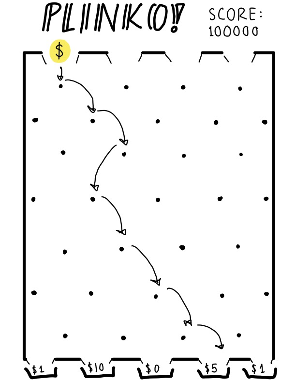

:warning: Everything between << >> needs to be replaced (remove << >> after replacing)

Plinko Simulation
## CS110 Final Project  Spring, 2024

## Team Members

Lucy Canick

***

## Project Description

The game plinko begins with a player dropping a token into a slot atop a vertical board with pegs. The pathway the token takes as it travels downward is based upon how it bounces off of each successive peg. The token eventually lands in one of several "buckets" at the bottom of the board, each one traditionally representing a different sum of money that the player wins if his or her token lands there. 

For my final project, I'll be creating a simulation of a plinko game in which the user can drop tokens onto the virtual board and score points based on the trajectory of those tokens. 

***    

## GUI Design

### Initial Design

### Final Design

## Program Design

### Features

1. Plinko board
2. Token which moves through board
3. Mathematical algorithm to decide which way the token travels
4. Buckets for tokens to land in; special effects when points are scored
5. Score counter

### Classes

- << You should have a list of each of your classes with a description >>

## ATP

| Step                 |Procedure             |Expected Results                   |
|----------------------|:--------------------:|----------------------------------:|
|  1                   | Run Counter Program  |GUI window appears with count = 0  |
|  2                   | click count button   | display changes to count = 1      |
etc...
